# ER-диаграмма базы данных «Ленивый Фермер»

## Диаграмма связей

```mermaid
erDiagram
    %% Основная таблица пользователей
    USERS {
        int user_id PK
        string username
        string first_name
        bigint balance
        int gems
        int exp
        int prestige_level
        decimal prestige_multiplier
        int city_level
        bigint total_harvested
        boolean is_banned
        timestamp last_activity
        timestamp joined_date
    }
    
    %% Администрирование
    ADMIN_ROLES {
        int id PK
        int user_id FK
        string role
        int assigned_by FK
        timestamp assigned_at
    }
    
    ADMIN_LOGS {
        int log_id PK
        int admin_id FK
        string action_type
        int target_user_id FK
        json old_value
        json new_value
        timestamp created_at
    }
    
    %% Растения и магазин
    PLANTS_DIRECTORY {
        string plant_id PK
        string name
        string emoji
        int grow_time
        int seed_price
        int sell_price
        int yield_amount
        int required_level
        boolean is_active
    }
    
    SHOP_ITEMS {
        int item_id PK
        string item_type
        string plant_id FK
        int price_coins
        int price_gems
        boolean in_shop
    }
    
    %% Игровой процесс
    INVENTORY {
        int id PK
        int user_id FK
        string item_type
        string plant_id FK
        int quantity
        int quality
    }
    
    FARMING_PLOTS {
        int id PK
        int user_id FK
        int plot_number
        string status
        string plant_id FK
        timestamp planted_at
        timestamp ready_at
        boolean fertilized
    }
    
    TRANSACTIONS {
        int tx_id PK
        int user_id FK
        string type
        string currency
        bigint amount
        bigint balance_after
        string source
        timestamp created_at
    }
    
    %% Промо-акции
    PROMOCODES {
        int id PK
        string code
        string promo_type
        string reward_type
        int reward_value
        int max_uses
        int used_count
        timestamp end_date
        boolean is_active
    }
    
    PROMO_ACTIVATIONS {
        int id PK
        int promo_id FK
        int user_id FK
        timestamp activated_at
    }
    
    %% Ежедневный бонус
    DAILY_BONUS_CONFIG {
        int id PK
        int day_number
        int coins
        int gems
        boolean is_special
    }
    
    DAILY_BONUS_CLAIMS {
        int id PK
        int user_id FK
        date claim_date
        int current_streak
        int coins_received
    }
    
    %% Ачивки
    ACHIEVEMENT_CATEGORIES {
        string category_id PK
        string name
        string icon
        int sort_order
    }
    
    ACHIEVEMENTS_DIRECTORY {
        string achievement_id PK
        string category_id FK
        string name
        string description
        int tier
        string parent_id FK
        string goal_type
        bigint goal_value
        int reward_coins
        int reward_gems
        boolean is_secret
    }
    
    PLAYER_ACHIEVEMENTS {
        int id PK
        int user_id FK
        string achievement_id FK
        bigint current_value
        boolean is_completed
        boolean reward_claimed
    }
    
    %% Социальные функции
    NEIGHBORS {
        int id PK
        int user_id FK
        int neighbor_id FK
        string status
        int helped_count
        timestamp helped_at
    }
    
    GIFTS {
        int id PK
        int from_user_id FK
        int to_user_id FK
        string gift_type
        int amount
        string status
        timestamp sent_at
    }
    
    LEADERBOARDS {
        int id PK
        string leaderboard_type
        string period
        int user_id FK
        int rank
        bigint value
    }
    
    %% Логирование
    LOGS {
        int log_id PK
        string log_group
        string log_level
        int user_id FK
        string action
        timestamp created_at
    }
    
    SECURITY_LOGS {
        int log_id PK
        string event_type
        int user_id FK
        int admin_id FK
        string ban_reason
        timestamp created_at
    }
    
    %% События
    SEASONAL_EVENTS {
        int event_id PK
        string name
        timestamp start_date
        timestamp end_date
        boolean is_active
    }
    
    EVENT_PARTICIPANTS {
        int id PK
        int event_id FK
        int user_id FK
        bigint score
        int rank
    }
    
    %% Связи
    USERS ||--o{ ADMIN_ROLES : "has role"
    USERS ||--o{ ADMIN_LOGS : "performs"
    USERS ||--o{ ADMIN_LOGS : "targeted by"
    
    USERS ||--o{ INVENTORY : "owns"
    USERS ||--o{ FARMING_PLOTS : "has"
    USERS ||--o{ TRANSACTIONS : "makes"
    
    PLANTS_DIRECTORY ||--o{ INVENTORY : "stored in"
    PLANTS_DIRECTORY ||--o{ FARMING_PLOTS : "planted in"
    PLANTS_DIRECTORY ||--o{ SHOP_ITEMS : "sold as"
    
    USERS ||--o{ PROMO_ACTIVATIONS : "activates"
    PROMOCODES ||--o{ PROMO_ACTIVATIONS : "has"
    
    USERS ||--o{ DAILY_BONUS_CLAIMS : "claims"
    
    ACHIEVEMENT_CATEGORIES ||--o{ ACHIEVEMENTS_DIRECTORY : "contains"
    ACHIEVEMENTS_DIRECTORY ||--o{ PLAYER_ACHIEVEMENTS : "tracked in"
    USERS ||--o{ PLAYER_ACHIEVEMENTS : "earns"
    
    USERS ||--o{ NEIGHBORS : "befriends"
    USERS ||--o{ NEIGHBORS : "is neighbor of"
    USERS ||--o{ GIFTS : "sends"
    USERS ||--o{ GIFTS : "receives"
    USERS ||--o{ LEADERBOARDS : "ranked in"
    
    USERS ||--o{ LOGS : "generates"
    USERS ||--o{ SECURITY_LOGS : "involved in"
    
    SEASONAL_EVENTS ||--o{ EVENT_PARTICIPANTS : "has"
    USERS ||--o{ EVENT_PARTICIPANTS : "participates in"
```

## Описание связей

### 1. Пользователи и администрирование
- **USERS → ADMIN_ROLES** (1:0..1) — один пользователь может иметь одну роль
- **USERS → ADMIN_LOGS** (1:N) — админ совершает действия
- **ADMIN_LOGS → USERS** (N:1) — действие направлено на пользователя

### 2. Игровой процесс
- **USERS → INVENTORY** (1:N) — у пользователя много предметов
- **USERS → FARMING_PLOTS** (1:N) — у пользователя много грядок
- **PLANTS_DIRECTORY → INVENTORY** (1:N) — растения хранятся в инвентаре
- **PLANTS_DIRECTORY → FARMING_PLOTS** (1:N) — растения сажаются на грядки

### 3. Экономика
- **USERS → TRANSACTIONS** (1:N) — пользователь совершает транзакции
- Транзакции неизменяемы (audit trail)

### 4. Ачивки
- **ACHIEVEMENT_CATEGORIES → ACHIEVEMENTS_DIRECTORY** (1:N)
- **ACHIEVEMENTS_DIRECTORY → PLAYER_ACHIEVEMENTS** (1:N)
- **USERS → PLAYER_ACHIEVEMENTS** (1:N)
- Иерархия через `parent_id` для многоуровневых ачивок

### 5. Социальные функции
- **USERS → NEIGHBORS** (1:N) — пользователь имеет соседей
- **USERS → GIFTS** (1:N) — отправляет/получает подарки
- Самоссылочная связь для друзей

### 6. Логирование
- **USERS → LOGS** (1:N) — пользователь генерирует логи
- **USERS → SECURITY_LOGS** (1:N) — события безопасности

## Соглашения об именовании

### Таблицы
- Множественное число: `users`, `transactions`
- Нижний регистр с подчеркиванием: `farming_plots`
- Префиксы для групп: `admin_`, `player_`, `daily_`

### Поля
- Первичный ключ: `id` или `{table}_id`
- Внешний ключ: `{table}_id`
- Время создания: `created_at`
- Время обновления: `updated_at`
- Флаги: `is_{adjective}` (is_active, is_banned)

### Индексы
- `idx_{table}_{field}` для простых
- `idx_{table}_{field1}_{field2}` для составных
